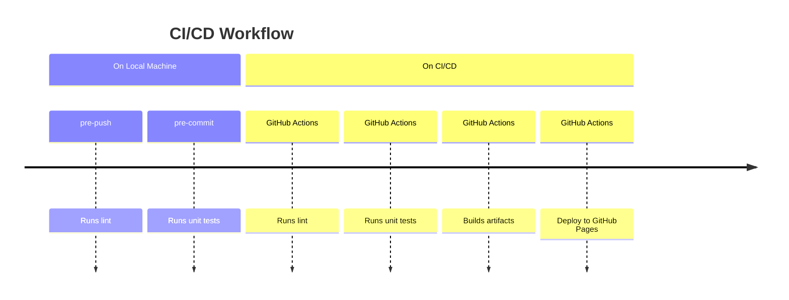

# Games

[Games](https://shyamajp.github.io/games) has a variety of games you can play on browser. Currently Old Maid is available, and hopefully more to come in the near future!

## List

| game      | status       |
| --------- | ------------ |
| Old Maid  | 🧪 alpha     |
| Blackjack | 🔨 pre-alpha |
| Sevens    | 💭 unstarted |
| Speed     | 💭 unstarted |
| Tycoon    | 💭 unstarted |
| Doubt     | 💭 unstarted |
| Hearts    | 💭 unstarted |
| Spade     | 💭 unstarted |
| Solitiar  | 💭 unstarted |

## Development

1. Clone the repository
   - Run `git clone git@github.com:shyamajp/games.git`💡
2. Install packages
   - Run `cd games`
   - Run `npm install`
3. Start the development server
   - Run `npm run dev`

## Tests

### Unit tests

- `npm run test` - Runs tests in the watch mode
- `npm run test:coverage` Runs tests and generate coverage report

## CI/CD

This repository uses GitHub Actions for a CI/CD platform. To ensure the code quality, lint and test steps take place locally and in the CI/CD pipeline.

