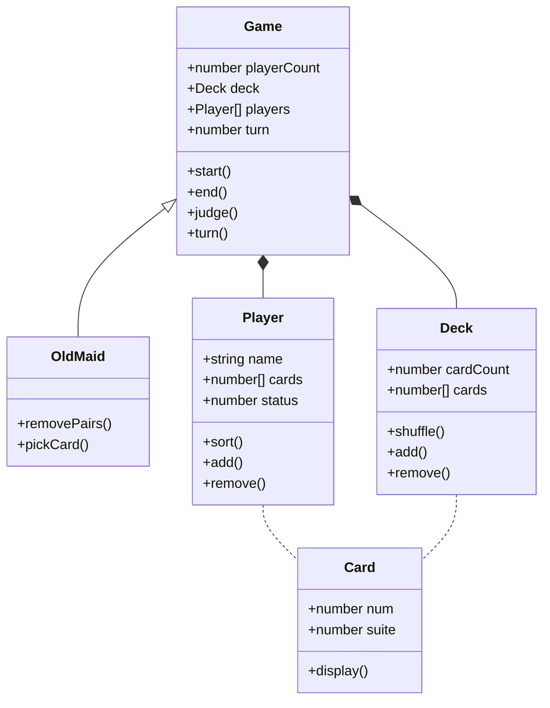

# Architecture

## Class diagram

TBD

```mermaid
classDiagram
    Game <|-- OldMaid
    Game *-- Player
    Game *-- Deck
    Player .. Card
    Deck .. Card
    class Player{
        +string name
        +number[] cards
        +number status
        +sort()
        +add()
        +remove()
    }
    class Deck {
        +number cardCount
        +number[] cards
        +shuffle()
        +add()
        +remove()
    }
    class Game {
        +number playerCount
        +Deck deck
        +Player[] players
        +number turn
        +start()
        +end()
        +judge()
        +turn()
    }
    class OldMaid {
        +removePairs()
        +pickCard()
    }
    class Card{
        +number num
        +number suite
        +display()
    }
```
