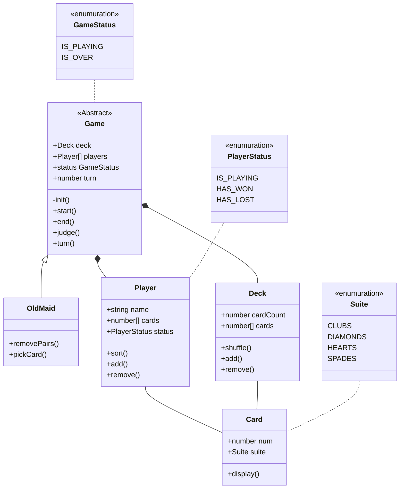

# Architecture

## Class diagram

TBD

```mermaid
classDiagram
    Game <|-- OldMaid
    Game *-- Player
    Game *-- Deck
    Player -- Card
    Deck -- Card
    Suite .. Card
    PlayerStatus .. Player
    GameStatus .. Game
    class Player{
        +string name
        +number[] cards
        +PlayerStatus status
        +sort()
        +add()
        +remove()
    }
    class Deck {
        +number cardCount
        +number[] cards
        +shuffle()
        +add()
        +remove()
    }
    class Game {
        <<Abstract>>
        +Deck deck
        +Player[] players
        +status GameStatus
        +number turn
        -init()
        +start()
        +end()
        +judge()
        +turn()
    }
    class OldMaid {
        +removePairs()
        +pickCard()
    }
    class Card {
        +number num
        +Suite suite
        +display()
    }
    class Suite {
        <<enumuration>>
        CLUBS
        DIAMONDS
        HEARTS
        SPADES
    }
    class PlayerStatus {
        <<enumuration>>
        IS_PLAYING
        HAS_WON
        HAS_LOST
    }
    class GameStatus {
        <<enumuration>>
        IS_PLAYING
        IS_OVER
    }
```
