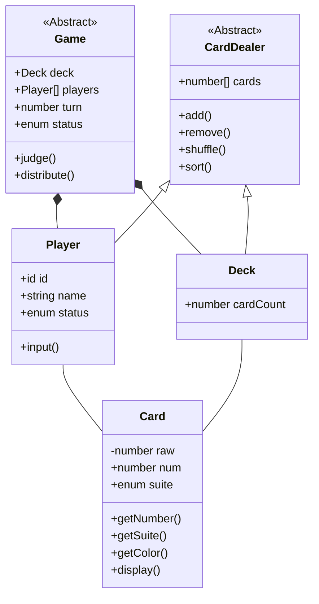
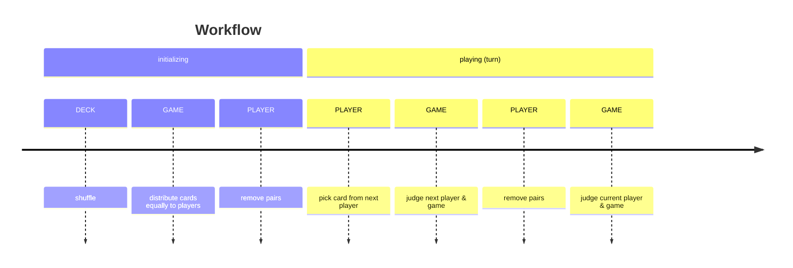
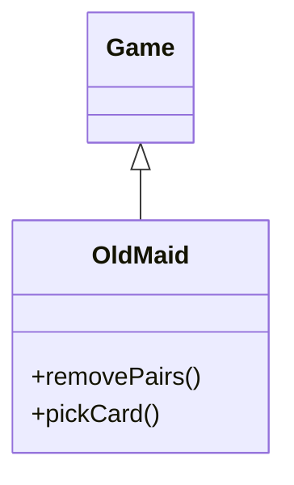
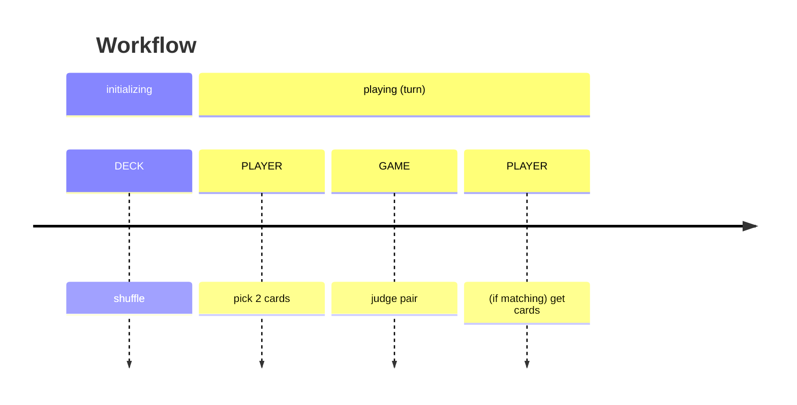
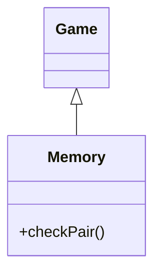
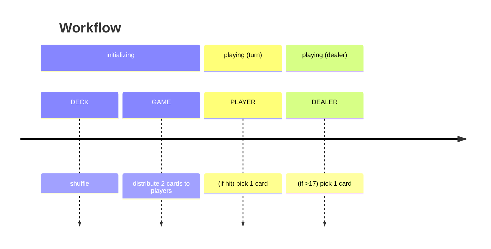
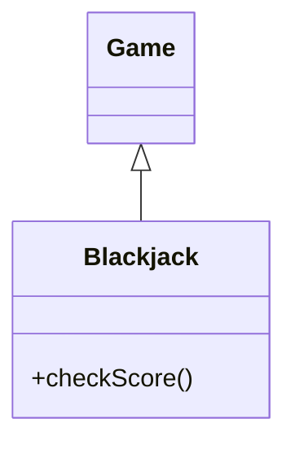

# Architecture

## Common

```mermaid
classDiagram
    Game *-- Player
    Game *-- Deck
    CardDealer <|-- Player
    CardDealer <|-- Deck
    Player -- Card
    Deck -- Card
    class CardDealer {
        <<Abstract>>
        +number[] cards
        +add()
        +remove()
        +shuffle()
        +sort()
    }
    class Player{
        +id id
        +string name
        +enum status
        +input()
    }
    class Deck {
        +number cardCount
    }
    class Game {
        <<Abstract>>
        +Deck deck
        +Player[] players
        +number turn
        +enum status
        +judge()
        +distribute()
    }
    class Card {
        -number raw
        +number num
        +enum suite
        +getNumber()
        +getSuite()
        +getColor()
        +display()
    }
```

## Old Maid

### Workflow

```mermaid
timeline
title Workflow
section initializing
    DECK   : shuffle
    GAME   : distribute cards equally to players
    PLAYER : remove pairs
section playing (turn)
    PLAYER : pick card from next player
    GAME   : judge next player & game
    PLAYER : remove pairs
    GAME   : judge current player & game
```

### Class diagram

```mermaid
classDiagram
    Game <|-- OldMaid
    class OldMaid {
        +removePairs()
        +pickCard()
    }
```

## Memory

### Workflow

```mermaid
timeline
title Workflow
section initializing
    DECK   : shuffle
section playing (turn)
    PLAYER : pick 2 cards
    GAME   : judge pair
    PLAYER : (if matching) get cards
```

### Class diagram

```mermaid
classDiagram
    Game <|-- Memory
    class Memory {
        +checkPair()
    }
```

## Blackjack

### Workflow

```mermaid
timeline
title Workflow
section initializing
    DECK   : shuffle
    GAME   : distribute 2 cards to players
section playing (turn)
    PLAYER : (if hit) pick 1 card
section playing (dealer)
    DEALER : (if >17) pick 1 card
```

### Class diagram

```mermaid
classDiagram
    Game <|-- Blackjack
    class Blackjack {
        +checkScore()
    }
```
